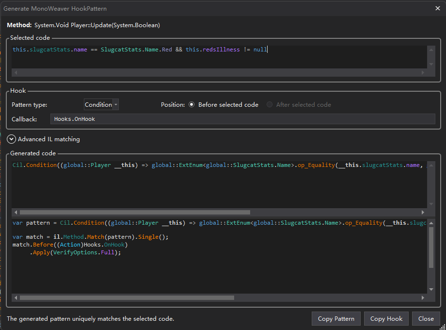
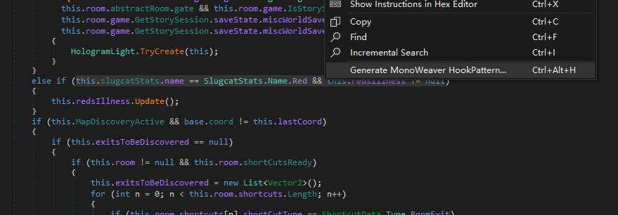

# MonoWeaver HookPatternPlugin

[简体中文](README_CN.md)

The companion dnSpyEx and ILSpy plugin for [MonoWeaver](https://github.com/pkuyo/MonoWeaver). It turns selected decompiled C# code into round-trip-verified lambda HookPatterns that can be used directly with MonoWeaver.



## Installation

Download the archive for your decompiler from **Releases**.

### dnSpyEx

1. Extract the dnSpyEx archive to `dnSpy/bin/Extensions/MonoWeaver.HookPatternPlugin/`.
2. Restart dnSpyEx.

### ILSpy

1. Extract the ILSpy archive next to `ILSpy.exe`.
2. Restart ILSpy.

## Usage

1. Open the target assembly and switch to the C# decompiler view.
2. Select a complete expression, condition, or side-effecting statement to match. You may also place the caret inside the target statement without selecting text.
3. Right-click and choose **Generate MonoWeaver HookPattern...**, or press `Ctrl+Alt+H`.

   

4. Review the following settings in the generator window:
   - **Pattern type**: choose `Value`, `Effect`, or `Condition` according to the selection's semantics.
   - **Position**: the default is before the complete selected code. When supported, it can be changed to after the selection. `Condition` does not support After.
   - **Callback**: enter the callback used by the generated code, such as `Hooks.OnHook`.
   - **Advanced IL matching**: expand this only when you need to select a subexpression, choose a specific IL anchor, or disambiguate multiple matches.
5. Confirm that the status reports that the generated Pattern uniquely matches the selected code.
6. Click **Copy Pattern** to copy only the lambda Pattern, or **Copy Hook** to copy the complete lookup, Before/After, and verification code.

The complete generated code can be placed directly in a MonoMod `ILContext` handler:

```csharp
using System;
using System.Linq;
using MonoMod.Cil;
using MonoWeaver.Cecil;
using MonoWeaver.Patterns;

private static void Patch(ILContext il)
{
    var pattern = Cil.Condition((int count) => count > 0);
    var match = il.Method.Match(pattern).Single();
    match.Before((Action)Hooks.OnHook)
        .Apply(VerifyOptions.Full);
}
```

The actual output uses `Cil.Value`, `Cil.Effect`, or `Cil.Condition` according to the selected code. Do not manually copy the Pattern type from this example.

## Selection rules and troubleshooting

- A selection must be fully representable by one `Value`, `Effect`, or `Condition` Pattern.
- If a selection contains multiple independent semantic roots, generation is rejected. Narrow the selection or generate separate Hooks.
- If the Pattern matches more than one location, choose a more specific candidate under **Advanced IL matching** instead of publishing ambiguous `.Single()` code.

## License

[MIT](LICENSE)
