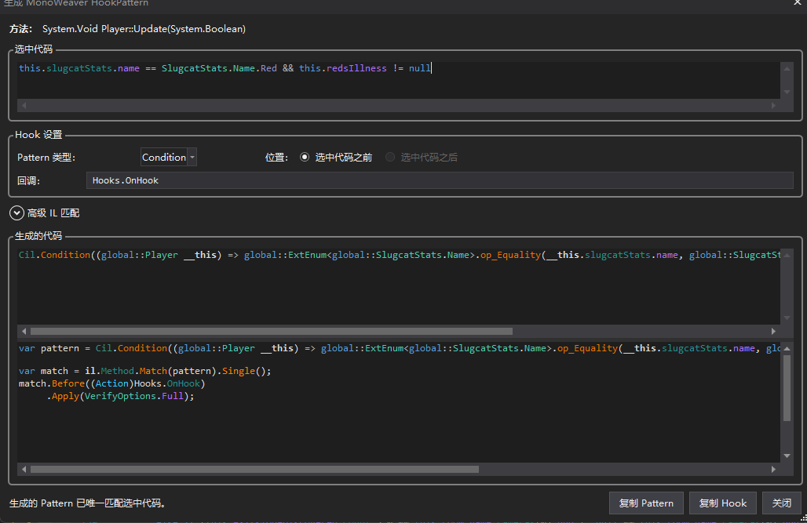
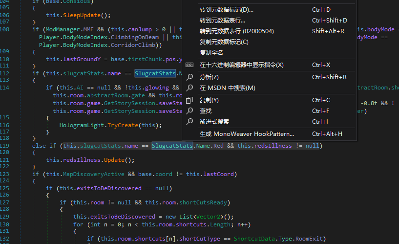

# MonoWeaver HookPatternPlugin

[English](README.md)

[MonoWeaver](https://github.com/pkuyo/MonoWeaver) 的 dnSpyEx 与 ILSpy 配套插件。它可以把选中的反编译 C# 代码转换为经过回匹配验证、可直接用于 MonoWeaver 的 lambda HookPattern。



## 安装

从 **Releases** 下载对应反编译器的压缩包。

### dnSpyEx

1. 将 dnSpyEx 压缩包解压到 `dnSpy/bin/Extensions/MonoWeaver.HookPatternPlugin/`。
2. 重启 dnSpyEx。

### ILSpy

1. 将 ILSpy 压缩包解压到 `ILSpy.exe` 所在目录。
2. 重启 ILSpy。

## 使用教程

1. 打开目标程序集并切换到 C# 反编译视图。
2. 选中要匹配的完整表达式、条件或带副作用语句。也可以只把光标放在目标语句内。
3. 右键选择 **Generate MonoWeaver HookPattern...**，或按 `Ctrl+Alt+H`。

   

4. 在生成窗口中检查：
   - **Pattern 类型**：根据选区语义选择 `Value`、`Effect` 或 `Condition`。
   - **位置**：默认在完整选区之前 Hook；支持时可改为选区之后。`Condition` 不支持 After。
   - **回调**：填写生成代码使用的回调，例如 `Hooks.OnHook`。
   - **高级 IL 匹配**：仅在需要改用子表达式、指定 IL 锚点或消除多处匹配时展开。
5. 确认状态显示 Pattern 已唯一匹配选中代码。
6. 点击 **复制 Pattern** 只复制 lambda Pattern；点击 **复制 Hook** 复制包含查找、Before/After 和验证的完整 Hook 代码。

生成的完整代码可直接放进 MonoMod `ILContext` handler，例如：

```csharp
using System;
using System.Linq;
using MonoMod.Cil;
using MonoWeaver.Cecil;
using MonoWeaver.Patterns;

private static void Patch(ILContext il)
{
    var pattern = Cil.Condition((int count) => count > 0);
    var match = il.Method.Match(pattern).Single();
    match.Before((Action)Hooks.OnHook)
        .Apply(VerifyOptions.Full);
}
```

实际生成结果会根据选区改用 `Cil.Value`、`Cil.Effect` 或 `Cil.Condition`，不要手工照抄示例中的 Pattern 类型。

## 选区规则与常见问题

- 一个选区必须能由单个 `Value`、`Effect` 或 `Condition` Pattern 完整覆盖。
- 如果选区包含多个独立语义根，插件会拒绝生成；应缩小选区或分别生成多个 Hook。
- 如果 Pattern 匹配到多处，先在“高级 IL 匹配”中选择更具体的候选，不要直接发布带歧义的 `.Single()` 代码。

## 许可证

[MIT](LICENSE)
